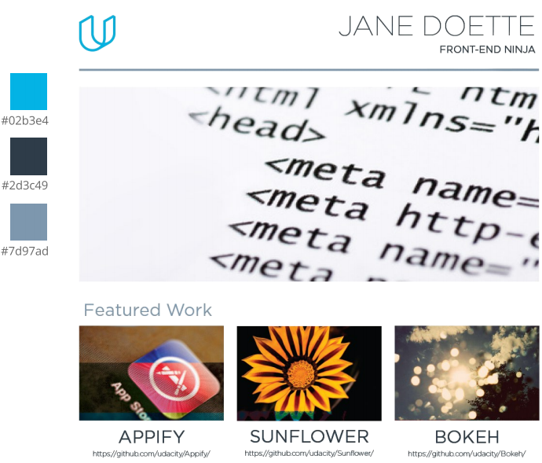

# Build a Portfolio Website

\**This project preview is available [HERE](https://edugord.github.io/Build-a-Portfolio/)*

## Overview

Build a Portfolio Website is the second project of [Udacity Full-Stack Web Developer Nanodegree](https://udacity.com/course/full-stack-web-developer-nanodegree--nd004). In this project student is challenged to apply what he/she have learned of HTML and CSS to transform [a design mock-up](https://d17h27t6h515a5.cloudfront.net/topher/2017/November/5a136147_design-mockup-portfolio/design-mockup-portfolio.pdf) into a functioning responsive website complete with images, text descriptions and links.

Here's the [Udacity's mock-up](https://d17h27t6h515a5.cloudfront.net/topher/2017/November/5a136147_design-mockup-portfolio/design-mockup-portfolio.pdf) preview for this project:

## Objective

As part of the student's own portfolio, he/she must built something that one's proud of as one's encouraged to get used to HTML and CSS [Code Validation](http://validator.w3.org/) and [Code Styling Standardization](http://udacity.github.io/frontend-nanodegree-styleguide/) while getting started with [Optimization](https://developer.mozilla.org/en-US/docs/Web/Guide/Performance) (this project uses SVGs whenever possible), [Responsiveness](https://developer.mozilla.org/en-US/docs/Learn/HTML/Multimedia_and_embedding/Responsive_images) (<srcset> has been used in this project) and Automation ([Grunt.js](https://gruntjs.com/) used to generate image files for small screens).

## Project Images (Preview)

Since this project is fully responsive, there are three main categories available:

### Large devices:

### Medium devices:

### Small devices:

